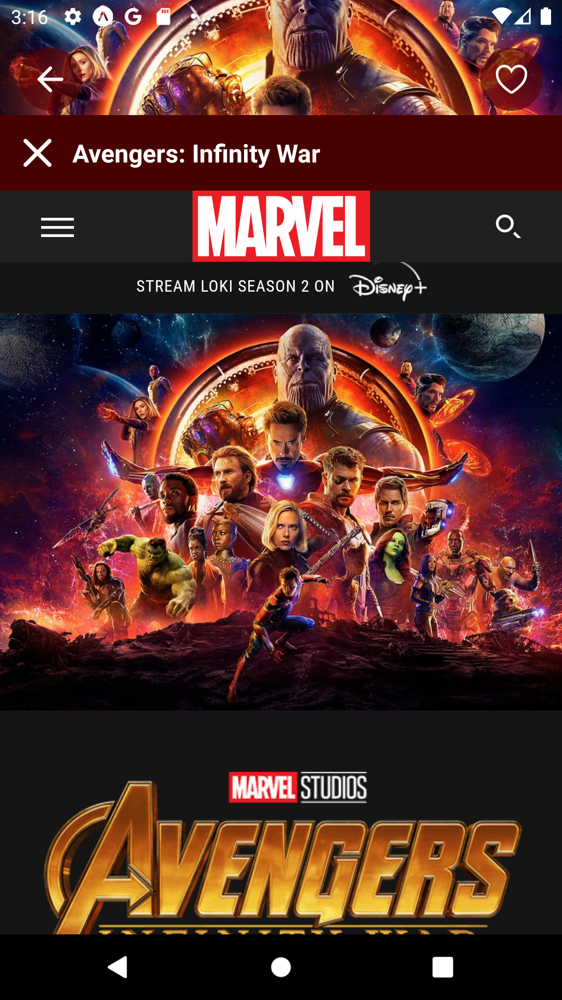

## Movie box 🍿🎥

This is a react native project. I have used the API
https://developer.themoviedb.org/reference/intro/getting-started to develop this movie app.

With this app you can: 🎬

- find a film searching by its name.
- get information about a film.
- consulting the film that are playing now, the most popular and top rated.
- you create a favorite movie list and save or delete movies.

# Technologie used for this application 💻

- react native
- expo
- react native async storage
- react native webview
- styled components
- axios

## Screenshots

  
  
  
  
  
  
  
 
 

 

# Moviebox
